Getting Start
=========

Android Application development process

  - Programing in JAVA, Design / Layout in XML
  - หลังจากจากการเขียนโปรแกรมต่างๆ แล้ว เราก็จะใช้เครื่องมือเพื่อที่จะ Build/Compile files ต่างของแอพพลิเคชัน เพื่อเป็นการรวมไฟล์ทุกอย่างอยู่ใน Package เดียวกันซึ่งไฟล์ที่ได้นั้นจะมีนามสกุลของไฟล์คือ .apk หลังจากได้ไฟล์ .apk เราก็สามารถที่จะนำแอพที่เราพัฒนาไป install ยังมือถือได้หรือแม้กระทั่ง submit กับ Google Play ต่อไป
  - ไฟล์ทุกไฟล์ที่ใช้สำหรับการพัฒนาแอพพลิเคชันถูกจัดการโดย Integrated Dvelopment Enviroment (IDE)
  - โดยทั่วไปแล้ว IDE ที่ใช้สำหรับการพัฒนา Android แอพพลิเคชันจะใช้ Eclipse แต่ตอนนี้กำลังจะถูกแทนที่โดย Android Studio ซึ่งเป็นการพัฒนาจาก Google โดยตรง

***

Task
=========

 - Download & Install Android Studio
 - Set up testing on devices and emulators.
 - สร้าง Android แอพพลิเคชัน เพื่อแสดงขอความ "Hello World" บนจอภาพ

***

Installing Android Studio
---------------------
สิ่งสำคัญสิ่งหนึ่งก่อนการติดตั้ง Android Studio นั่นก็คือ Java Development Kit หรือ JDK เราสามารถทำการตรวจสอบได้ว่าเครื่องคอมพิวเตอร์ของเรานี้ได้มีการติดตั้ง JDK แล้วหรือไม่ ผ่านทาง Terminal โดยใช้คำสั่งดังนี้

```
java -version
```

หลังจากการรันคำสั่งข้างต้นแล้วถ้าเครื่องคอมพิวเตอร์ของเรามีการติดตั้ง JDK เป็นที่เรียบร้อยแล้วจะมีผลลัพท์ดังรูปต่อไปนี้

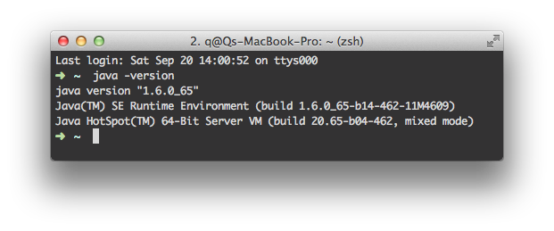

ในกรณีที่ Terminal แสดงผมลัพท์ออกมาว่า "Command not found" แสดงว่าเครื่องคอมพิวเตอร์ของเรายังไม่ได้ทำการติดตั้ง JDK ดังนั้นต้องทำการติดตั้ง JDK ก่อนโดยสารมารถเข้าไป download ได้ตามลิงค์ต่อไปนี้ : [download the JDK] จาก Page ของ Oracle 

หลังจากติดตั้ง JDK เป็นที่เรียบร้อยเราจะไปยัง Page : [Android Studio Page] เพื่อทำการ Download Android Studio ที่มีเวอร์ชั่นและ System ที่ตรงกับเครื่องคอมพิวเตอร์ของแต่ละคน

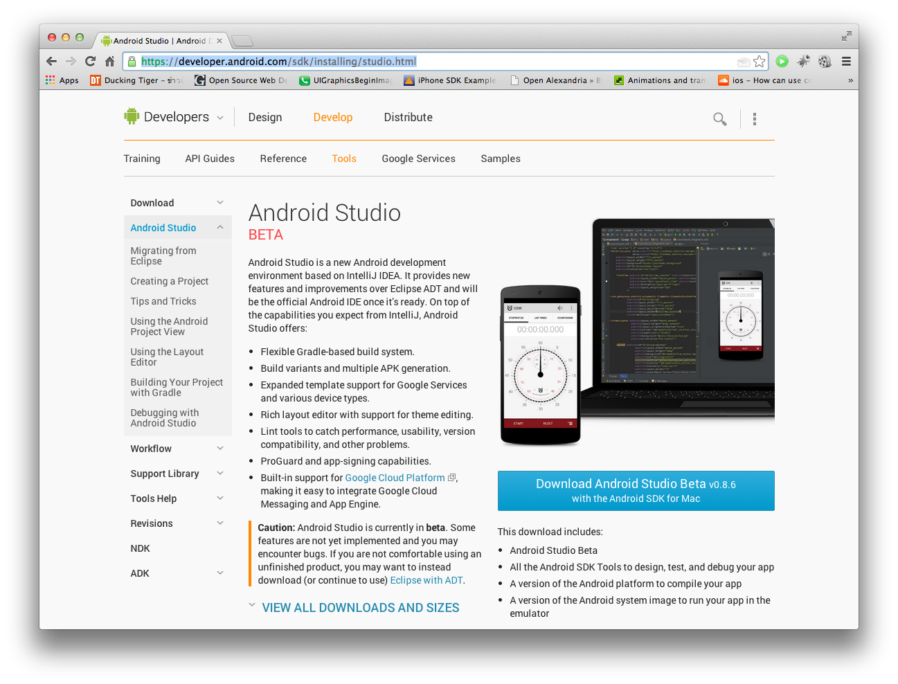

เมื่อเปิด Android Studio ขึ้นมาเราจะพบได้กับ Loading screen ดังรูปต่อไปนี้

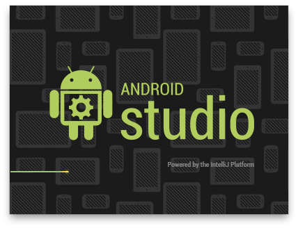

หลังจากนั้นจะพบกับ Welcome screen ดังรูปต่อไปนี้

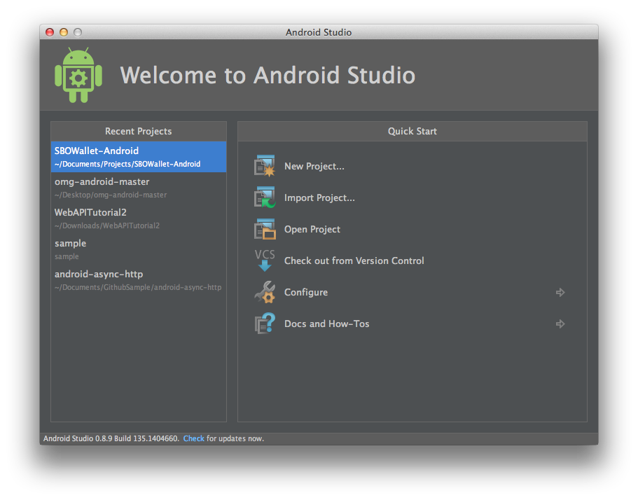

***

Creating Hello Android
---------------------
ใน section นี้เราจะได้เริ่มลงสร้างแอพพลิเคชัน "Hello World" โดยที่ตัวแอพพลิเคชันจะมีการใช้ชื่อของ User(หรือตัวเราเอง) มาสร้างเป็นข้อความต้อนรับและจะแสดงทุกครั้งที่ User ได้เข้าใช้งานแอพพลิเคชัน

 - ขั้นตอนที่ 1 สร้าง Project โดยทำการเลือกเมนู "New Project..." ในหน้า Welcome screen ดังรูป

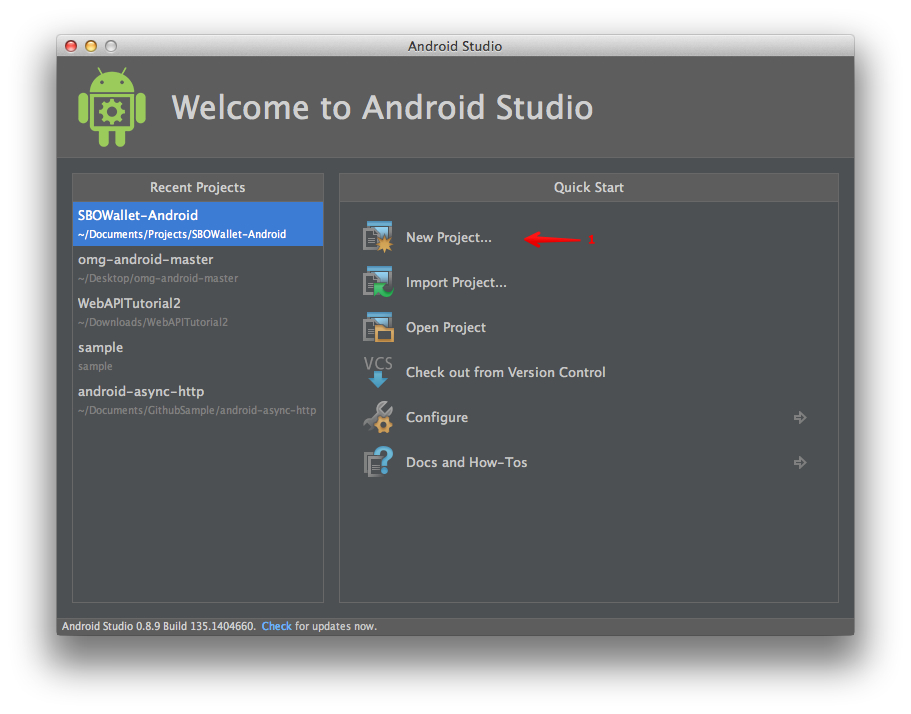

หลังจากนั้นจะพบกับจอภาพดังรูปต่อไปนี้


###### Note * ในกรณีที่มีการเปิด Android Studio ไว้อยู่ก่อนแล้วหรือ Welcome Screen ไม่ปรากฎ ให้ไปทีเมนูบาร์เลือก File/New Project เพื่อสร้าง Project

หลังจากที่เราได้ทำการเลือกเมนูในการสร้าง Project ใหม่จะมีหน้าต่าง New Project แสดงขึ้นมา ดังรูปต่อไปนี้

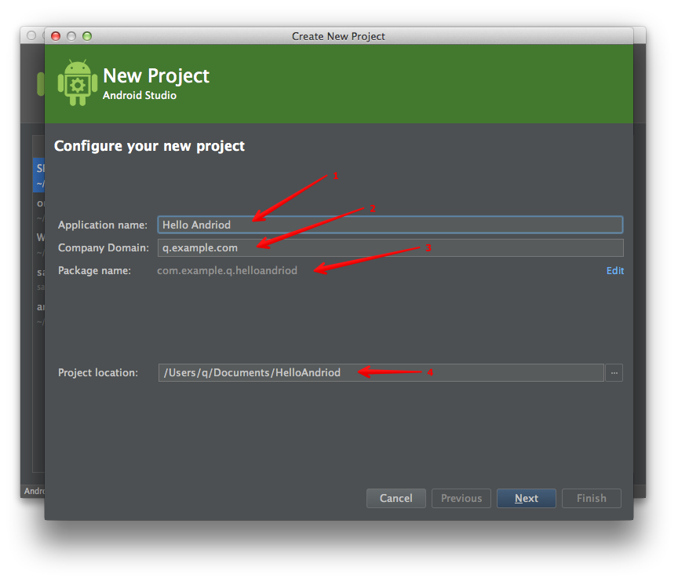

จากรูปข้างต้นสามารถอธิบายได้ดังต่อไปนี้

1. ช่อง Application name หมายถึงช่องสำหรับตั้งชื่อแอพพลิเคชัน
2. ช่อง Company Domain หมายถึง URL หรือ โดเมนเนมขององกร์ของผู้พัฒนา ตัวโดมเมนเนมตัวนี้จะถูกใช้เป็นเสมือนกับ Identifier ของแต่ละแอพพลิเคชัน
3. ช่อง Package name หมายถึง Indertifer ของแอพพลิเคชัน Package จะสังเกตุได้ว่าจะเกิดมาจาก Company Domain ดังที่กล่าวถึงไปก่อนหน้านี้
4. ช่อง Project location เป็นช่องสำหรับให้ผู้หัฒนาได้เลือกตำแหน่งที่จะทำการจัดเก็บข้อมูลหรือไฟล์ต่างๆ บน Hard Drive ของเครื่อง

เมื่อเราได้ทำการตั้ค่าต่างๆ ภายในหน้าต่างนี้เป็นที่เรียบร้อยแล้ว เราก็จะพบกับอีกหนึ่งหน้าต่าง ดังรูปต่อไปนี้

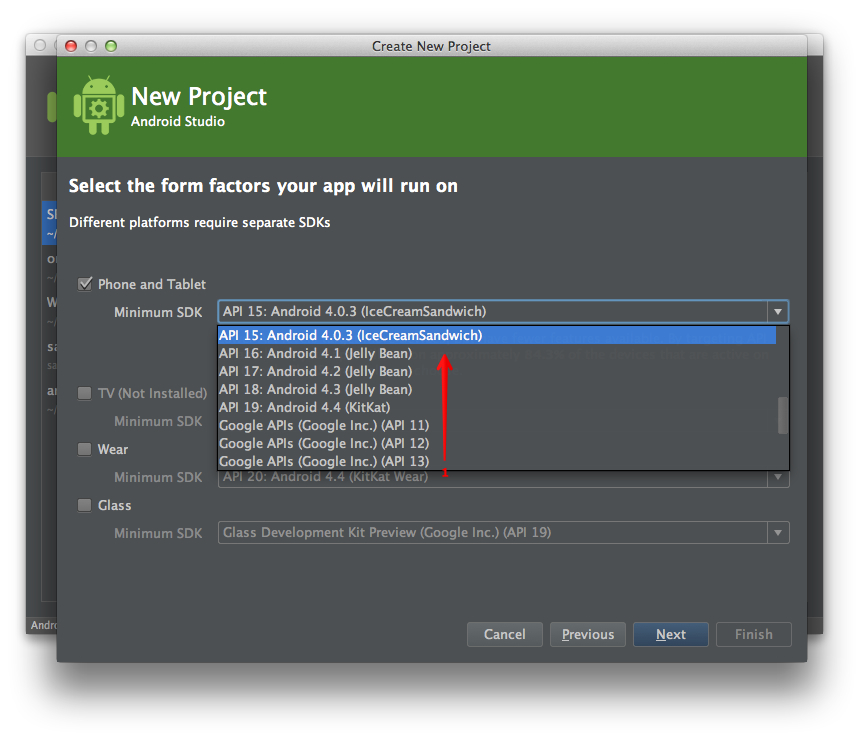

จากรูปข้างต้นสามารถอธิบายได้ดังต่อไปนี้

1. ช่อง Minimum SDK หมายถึง Android API version ที่ต่ำที่สุดที่แอพพลิเคชันที่กำลังจะพัฒนาสามารถ Run ได้ ซึ่งในตัว Part แรกนี้เราจะทำการเลือกที่ "API 15: Android 4.0.3 (IceCreamSandwich)" 

###### Note * การตั้งค่า Minimum SDK ขึ้นอยู่กับ Requirement หรือ Device ที่ต้องการจะให้แอพพลิเคชัน Support สำหรับข้อมูลเพิ่มเติมเกี่ยวกับ API version และสถิติอื่นๆ สามารถเข้าได้จาก link นี้ [Anddroid Dashboard] 

คลิก Next แล้วเราจะพบกับอีกหนึ่งหน้าต่างสำหรับการตั้งค่าของ Project ดังรูปต่อไปนี้

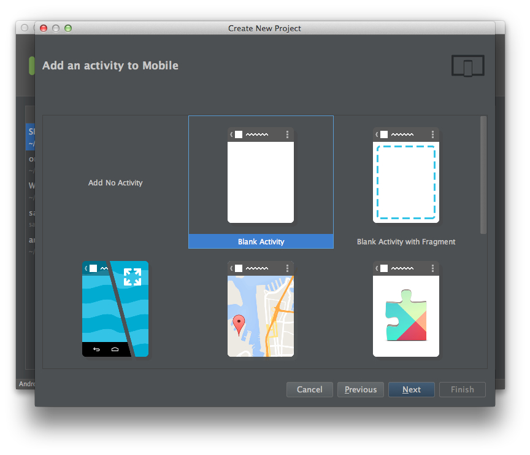

จากรูปข้างต้น เห็นได้ว่าเราสามารถเลือกการตั้งค่าของูปแบบการแสดงผลของแอพพลิเคชันได้ในหลายๆ รูปแบบโดยรูปแบบทั้งหมดที่เป็นไปได้จะมีดัง list ต่อไปนี้

* Blank Activity
* Blank Activity with Fragment
* Fullscreeb Activity
* Google Map Activity
* Google Play Services Activity
* Login Activity
* Master / Detail Activity
* Navigation Drawer Activity
* Settings Activity
* Tabbed Activity

ใน Part แรกนี้เราจะตั้งค่าไปที่ "Blank Activity" หลังจากนั้นกด Next ก็จะพบกับหน้าต่างสุดท้ายสำหรับการตั่งค่าเริ่มต้นของ Project ของเรา ดังรูปต่อไปนี้

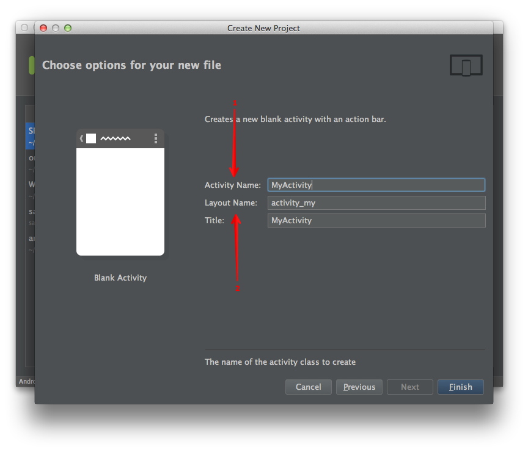 

จากภาพสามารถอธิบายได้ดังนี้

1. Activity Name โดยทั่วไปแล้วในการพัฒนา Android แอพพลิเคชันจะมอกคำว่า "Activity" เสมือนเป็นหน้าต่างในแอพพลิเคชันของเรา ซึ่งเป็นได้ทั้งหมดของจอภาพหรือเป็นแค่ส่วนใดส่วนของจอภาพก็ได้
2. Layout Name เป็นช่องสำหรับตั้งชื่อไฟล์ Layout ของ Activity นั้นๆ โดยที่ไฟล์ Layout จะถูกจัดเก็บในรูปแบบของ Android XML

เมื่อเราได้ทำการตั้งค่าเริ่มต้นต่างๆ เป็นที่เรียบร้อยแล้ว ถึงเวลาที่เราจะเริ่ม Project โดยการคลิกที่ปุ่ม "Finish" ตัว Android Studio จะทำการสร้างไฟล์ต่างๆและตั้งค่าตามที่เราได้ทำการเลือกไว้ โดยในกระบวนการนี้จะใช่เวลารระยะหนึ่งในการสร้าง Project ขึ้นมาโดยสัง้เกตุได้จากรูปดังต่อไปนี้

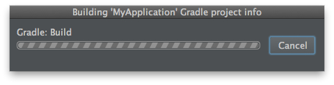 

***

Running on an Emulator or Device
---------------------

หลังจากที่เราได้ใช้เวลา(อันยาวนาน)ในการสร้าง Android Project ขึ้นมา ถึงเวลาแล้วที่เราจะนำเอาแอพพลิเคชันไปแสดงผลยัง Emulator หรือ Device โดยมีรายละเอียดดังต่อไปดังนี้

* เริ่มจากคลิกที **Edit Configurations** ดังรูปต่อไปนี้

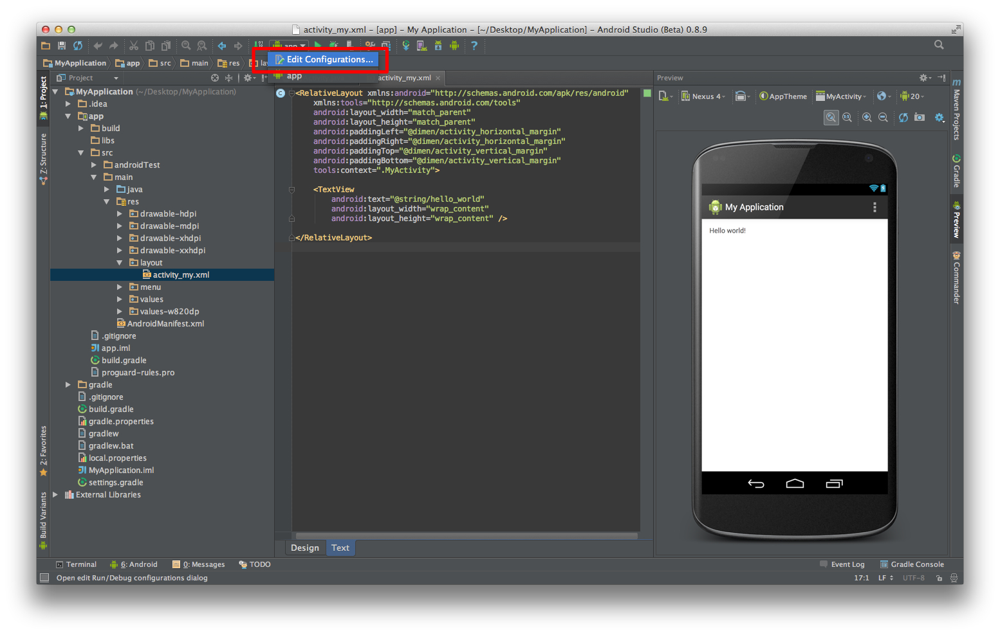

* หลังจากนั้นจะมี Dialog ปรากฎขึ้นดังรูปต่อไปนี้

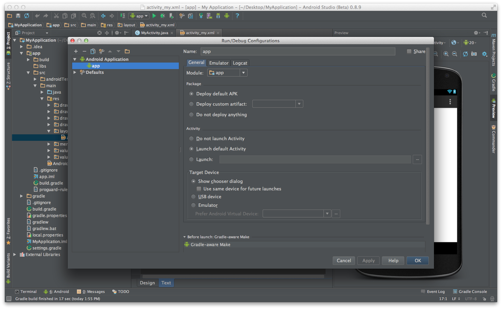

จากรูปข้างต้น เราจะไป Focus ที่ **Target Device** sction โดยส่วนนี้ทำหน้าเป็นตัวคอยบอก Android S3tudio ให้รู้ว่าทุกครั้งที่แอพพลิเคชันของเรา Run จะไปแสดงผลที่ไหน Emulator / Device หลังจากนี้เราจะได้เริ่มทำการตั้งค่าให้กับ Emulator ของเราโดยเลือกไปที่ Option: Emulator แล้วไปคลิกที่ปุ่มถัดจาก "Prefer Android Virtual Device" drop-down หลังจากนั้นจะปรากฎหน้าต่างของ Android Virtual Device (AVD Manager ขึ้นมาดังรูปตามลำดับต่อไปนี้

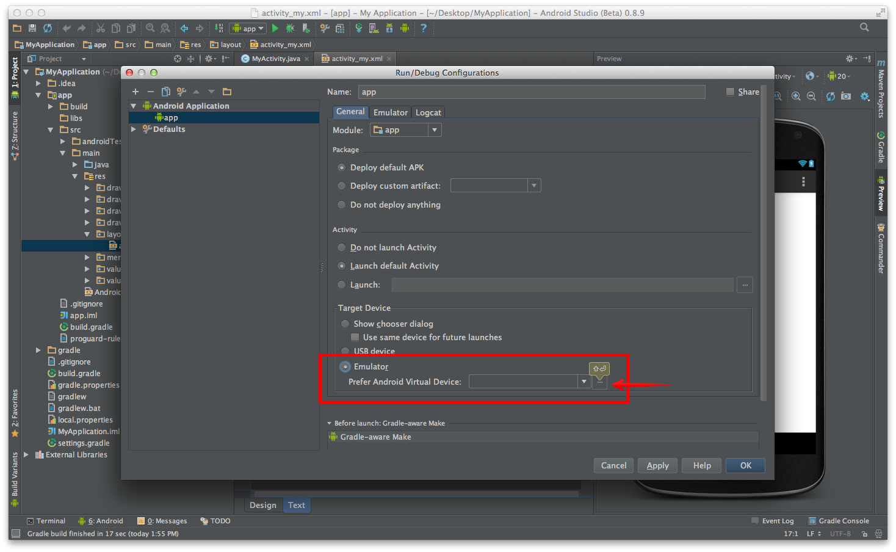
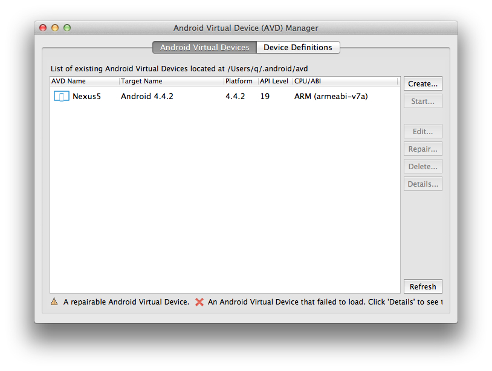

ใน ADV เราสามารถ สร้าง/แก้ไข/ลบ Emulator ได้ตามต้องการ ถึงส่วนนี้แล้วเราจะมาสร้าง Emulator โดยคลิกที่ปุ่ม "Create" โดยจะมีหน้าต่างของ option setting ของ Emulator ปรากฎขึ้น ดังรูปต่อไปนี้ตามลำดับ

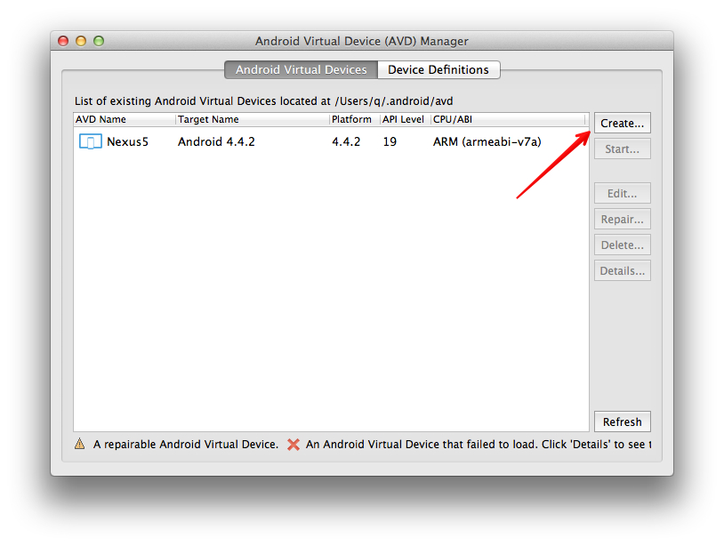
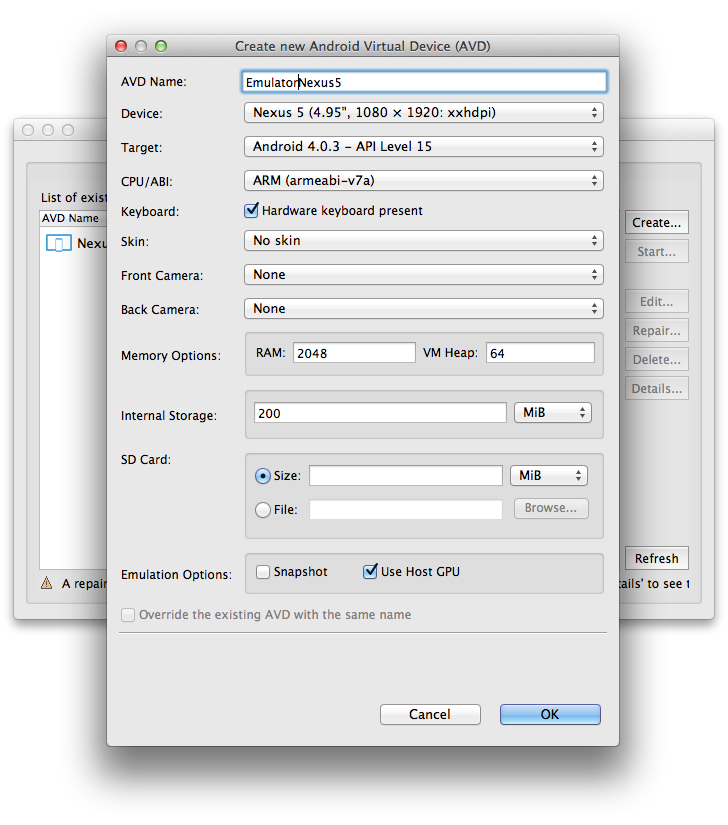

###### ใน Part นี้แนะนำให้ใช้การ setup ตามภาพข้างต้น

เมื่อทำการ setup ค่าต่างๆ ของ Emulator เรียบร้อยแล้วจะมี Dialog ปรากฎขึ้นอีกครั้งโดยจะนำเสนอข้อมูลเกี่ยวกับการ Setup ของ Emolator เพื่อ Preview ให้ผู้พัฒนาได้ตรวจสอบอีกครั้ง ดังรูปต่อไปนี้

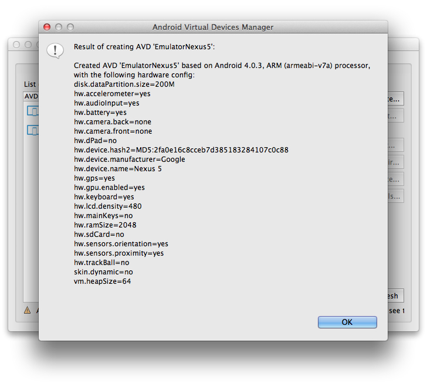

หลังจากการ Setup เสร็จสอ้น Emulator ที่เราก็จะปรกฎใน List ของ AVD Manager ดังรูปต่อไปนี้

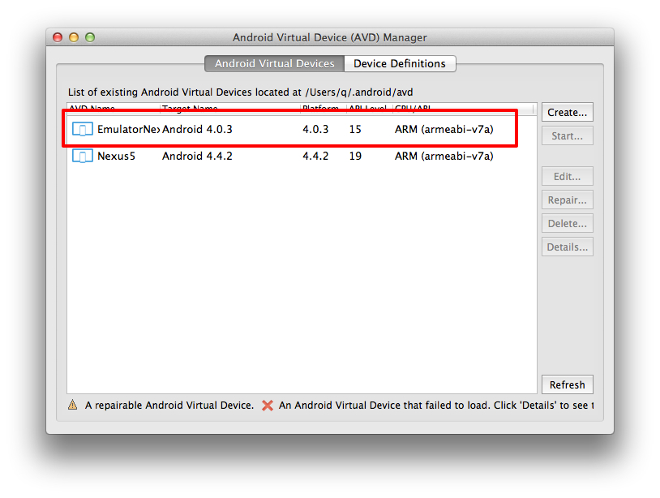

เมื่อเราได้เตรียมและสร้าง Emulator สำหรับแอพพลิเคชันเป็นที่เรียบร้อยแล้ว ให้เราเปิด AVD Manager แล้วกลับมาที่หน้าต่างของ **Edit Configurations** เพื่อไปทำการเลือก Emulator ที่ได้สร้างไว ดังรูปต่อไปนี้

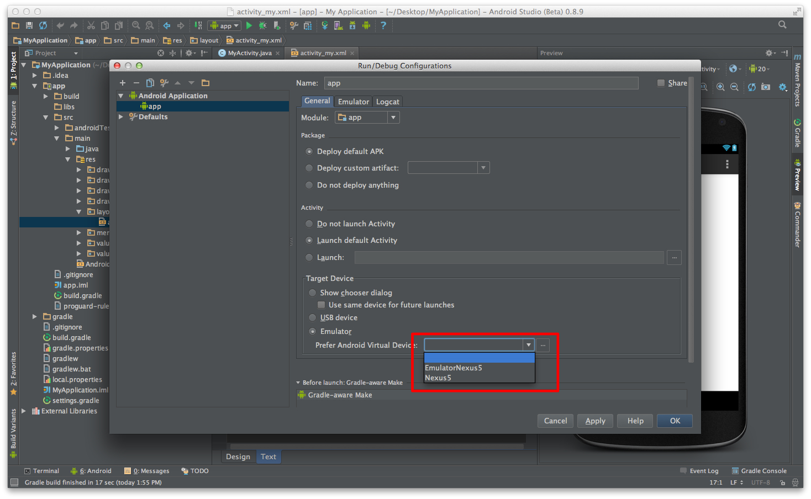

หลังจากนั้นเราก็จะถูกนำกลับมาที่หน้าต่างของ Android Studio อีกครั้ง ถึงเวลามาเทสแอพพลิเคชันของ โดยคลิกที่ปุ่ม Run ที่มีลักษณะคล้ายกับปุ่ม Play ดังรูปต่อไปนี้

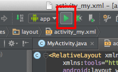

###### ในการ Run แอพพลิเคชันกับ Emulator ในครั้งแรกอาจจะใช้ระยะเวลาค่อนข้างยาวนาน

##ในที่สุด!!! แอพพลิเคชันแรกก็ได้มีชีวิตบน Emulator ดังรูปต่อไปนี้

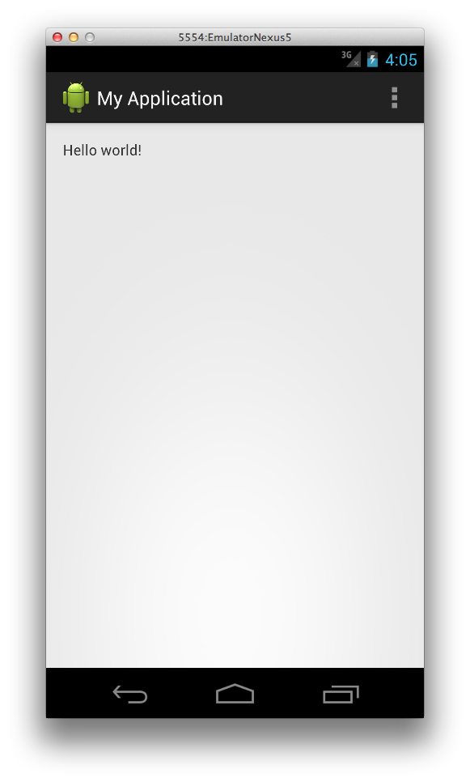

***

Putting your name on the app
--------------
ถึงเวลาที่เราจะนำเอาชื่อของเราไปปแสดงผลยังแอพพลิเคชัน โดยเริ่มจากไปที่ **Project Navigation Panel** เลือกไปที่ไฟล์ **strings.xml** ภายใต้ Path : **src/main/res/values/strings.xml** ดังรูปต่อไปนี้

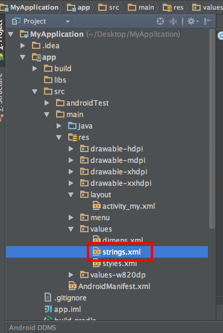

จากนั้นใน Work Space ของ Android Studio จะทำการเปิดไฟล์ strings.xml ขึ้นมาพร้อมให้เราทำการ edit ดังรูป

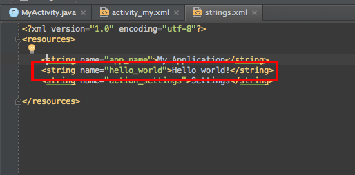

จากรูปข้างต้นจะเห็นได้ว่ามี XML คีย์หนึ่งที่มีชื่อว่า **hello_world** โดยมีค่าของคีย์คือ **Hello world!** จากส่วนนี้เราสามารถจะแก้ไขค่าของ string นี้ได้ ดังรูปตัวอย่างต่อไปนี้

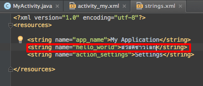

สุดท้ายทำการ Run แอพพลิเคชันอีกครั้ง แอพพลิเคชันแรกของเราก็จะทำการแสดงผลตามค่าที่เรากำหนดให้

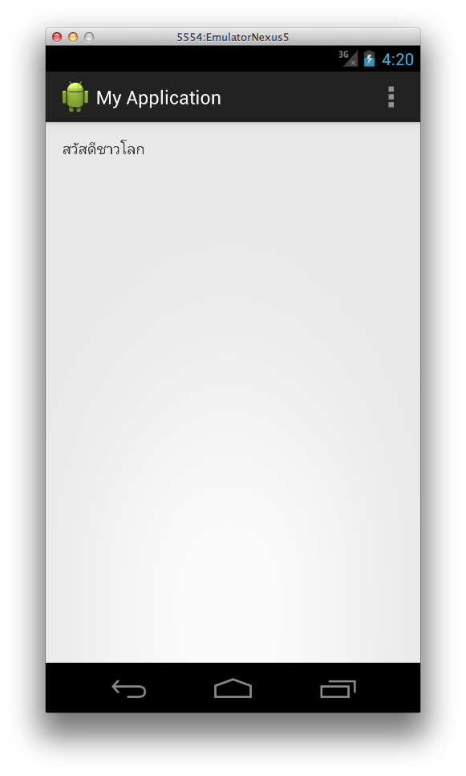

***


[download the JDK]:http://www.oracle.com/technetwork/java/javase/downloads/index.html
[Android Studio Page]:https://developer.android.com/sdk/installing/studio.html
[Anddroid Dashboard]:https://developer.android.com/about/dashboards/index.html

